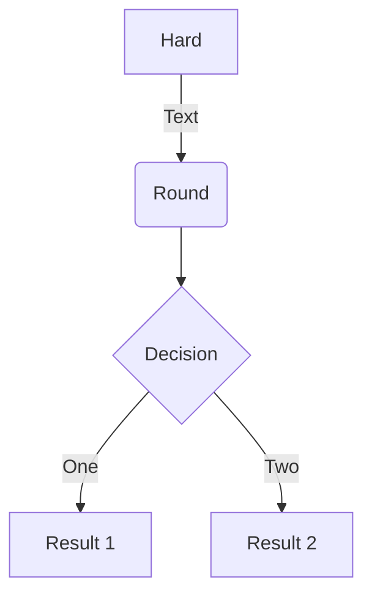
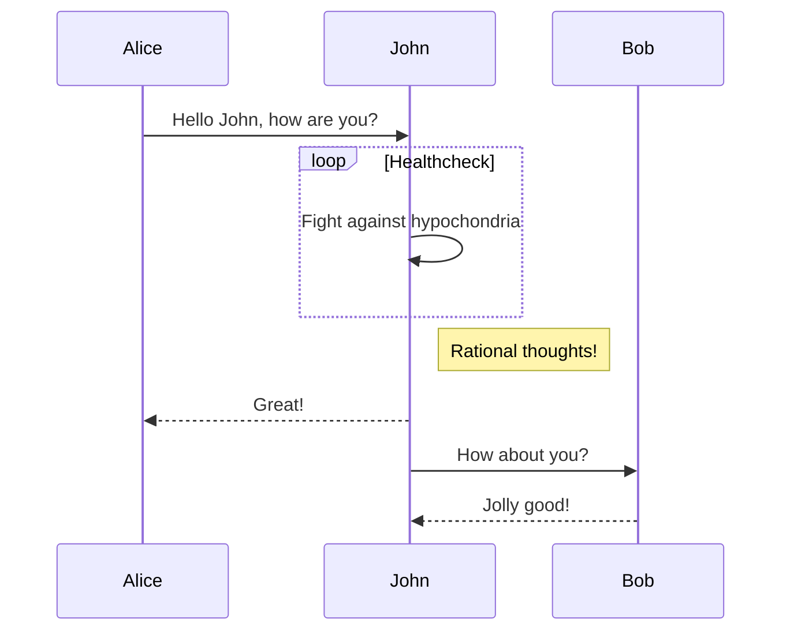
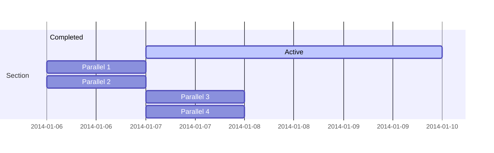
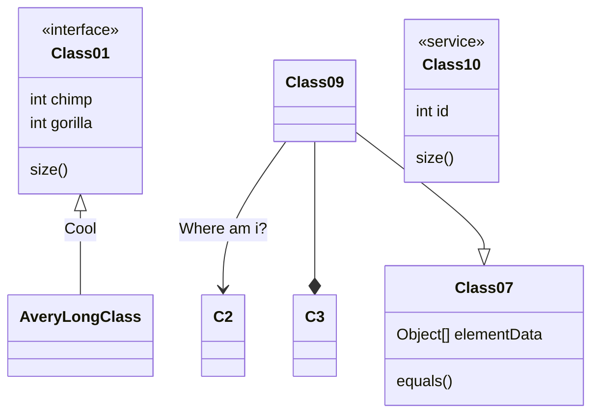
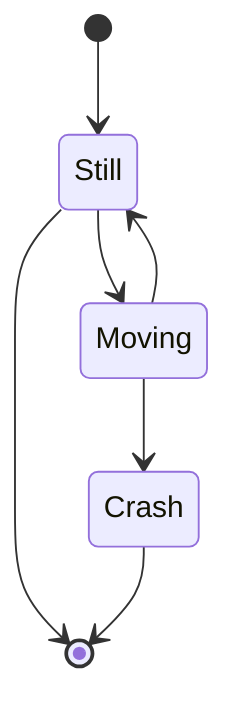
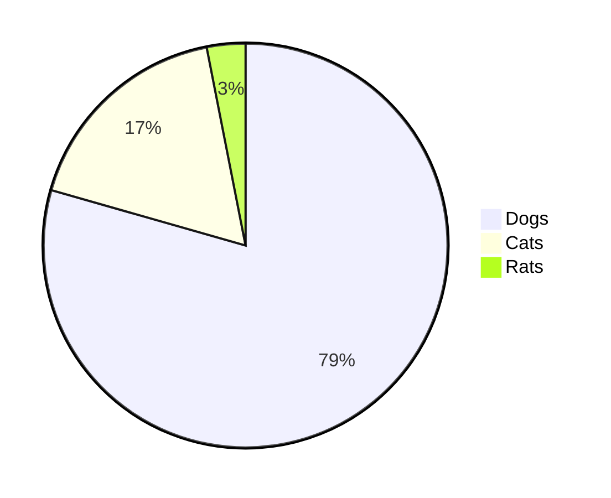

# File sizes after gzip:
```
Added Redux (although not used in logic yet):
  142.18 KB (+35.4 KB)  build\static\js\2.c4ed3a35.chunk.js
  6.6 KB (+649 B)       build\static\js\main.60c71a63.chunk.js
  779 B (-432 B)        build\static\js\runtime-main.f381864c.js
  457 B                 build\static\css\main.016cf4f4.chunk.css
  NOTE: Why they huge 35K increase???
```

```
Commented out Redux:
  137.07 KB (-5.1 KB)  build\static\js\2.839202c1.chunk.js
  6.44 KB (-162 B)     build\static\js\main.3f69ecac.chunk.js
  779 B                build\static\js\runtime-main.f381864c.js
  457 B                build\static\css\main.016cf4f4.chunk.css
```

``` 
Remomved manually designed forms:
  137.08 KB (+6 B)  build\static\js\2.c2e34391.chunk.js
  6.28 KB (-197 B)  build\static\js\main.10c5b8f1.chunk.js
  779 B             build\static\js\runtime-main.f381864c.js
  457 B             build\static\css\main.016cf4f4.chunk.css
```

``` 
UI refinements...
  137.08 KB  build\static\js\2.c2e34391.chunk.js
  6.43 KB    build\static\js\main.8ef5cd86.chunk.js
  779 B      build\static\js\runtime-main.f381864c.js
  457 B      build\static\css\main.016cf4f4.chunk.css
```

```
Update Libraries / refactors / and new xref feature...
  145.84 KB (+4 B)  build\static\js\2.e804f2f3.chunk.js
  6.42 KB (-314 B)  build\static\js\main.745df201.chunk.js
  780 B             build\static\js\runtime-main.4b146d07.js
  457 B             build\static\css\main.016cf4f4.chunk.css
```

```
Change format of downloaded tables from array to object (with database PK used for keys):
            Physical :  1762
              Source :  1417
             Comment :  180
 Single-line comment :  151
       Block comment :  29
               Mixed :  31
 Empty block comment :  0
               Empty :  196
               To Do :  8
Number of files read :  27
  145.84 KB        build\static\js\2.e804f2f3.chunk.js
  6.44 KB (+14 B)  build\static\js\main.aa248f59.chunk.js
  780 B            build\static\js\runtime-main.4b146d07.js
  457 B            build\static\css\main.016cf4f4.chunk.css
```

```
Added modern Redux ToolKit patterns to Sample page...
            Physical :  1761
              Source :  1407
             Comment :  180
 Single-line comment :  143
       Block comment :  37
               Mixed :  34
 Empty block comment :  0
               Empty :  208
               To Do :  10
Number of files read :  22
  157.88 KB (+66 B)  build\static\js\2.23550455.chunk.js
  6.71 KB (+107 B)   build\static\js\main.6c9dbc64.chunk.js
  780 B              build\static\js\runtime-main.4b146d07.js
  317 B              build\static\css\main.6ddade24.chunk.css
```

```
Initial implementation of Redux:
            Physical :  1543
              Source :  1279
             Comment :  126
 Single-line comment :  89
       Block comment :  37
               Mixed :  28
 Empty block comment :  0
               Empty :  166
               To Do :  5
Number of files read :  20
  157.98 KB (+107 B)  build\static\js\2.95c529cc.chunk.js
  6.12 KB (-604 B)    build\static\js\main.7e7aeb0d.chunk.js        
  780 B               build\static\js\runtime-main.4b146d07.js      
  317 B               build\static\css\main.6ddade24.chunk.css     
```

```
Perfected xref filtering with model.derivedModel
            Physical :  1599
              Source :  1327
             Comment :  132
 Single-line comment :  93
       Block comment :  39
               Mixed :  31
 Empty block comment :  0
               Empty :  171
               To Do :  8
Number of files read :  21
  158 KB           build\static\js\2.e7c21669.chunk.js
  6.29 KB (+62 B)  build\static\js\main.4829916c.chunk.js
  780 B            build\static\js\runtime-main.4b146d07.js
  317 B            build\static\css\main.6ddade24.chunk.css
```

```
Changed AutoForm to class component; removed unneeded useClass...
            Physical :  1637
              Source :  1372
             Comment :  134
 Single-line comment :  95
       Block comment :  39
               Mixed :  35
 Empty block comment :  0
               Empty :  166
               To Do :  9
Number of files read :  21  
  157.73 KB (-283 B)  build\static\js\2.fd84eb8d.chunk.js
  6.43 KB (+117 B)    build\static\js\main.82d36674.chunk.js
  780 B               build\static\js\runtime-main.4b146d07.js        
  317 B               build\static\css\main.6ddade24.chunk.css    
```

```
Refine XREF hack / correct edge cases...
            Physical :  1688
              Source :  1392
             Comment :  164
 Single-line comment :  125
       Block comment :  39
               Mixed :  38
 Empty block comment :  0
               Empty :  170
               To Do :  10
Number of files read :  21
  157.73 KB        build\static\js\2.cb1a2fa9.chunk.js
  6.52 KB (+95 B)  build\static\js\main.f55bd12d.chunk.js
  780 B            build\static\js\runtime-main.4b146d07.js
  317 B            build\static\css\main.6ddade24.chunk.css
```

```
Added initial Login page...
            Physical :  1985
              Source :  1627
             Comment :  184
 Single-line comment :  148
       Block comment :  36
               Mixed :  40
 Empty block comment :  0
               Empty :  214
               To Do :  14
Number of files read :  25
  158.01 KB  build\static\js\2.32592e31.chunk.js
  10.42 KB   build\static\js\main.5bb8ca3d.chunk.js
  779 B      build\static\js\runtime-main.af831f84.js
  317 B      build\static\css\main.6ddade24.chunk.css
```

# HELPFUL SNIPPETS:

npx sloc src -- get lines of code reports, presented above
choco upgrade yarn 

# DOC TEST:


## See https://libraries.io/npm/mermaid ...











