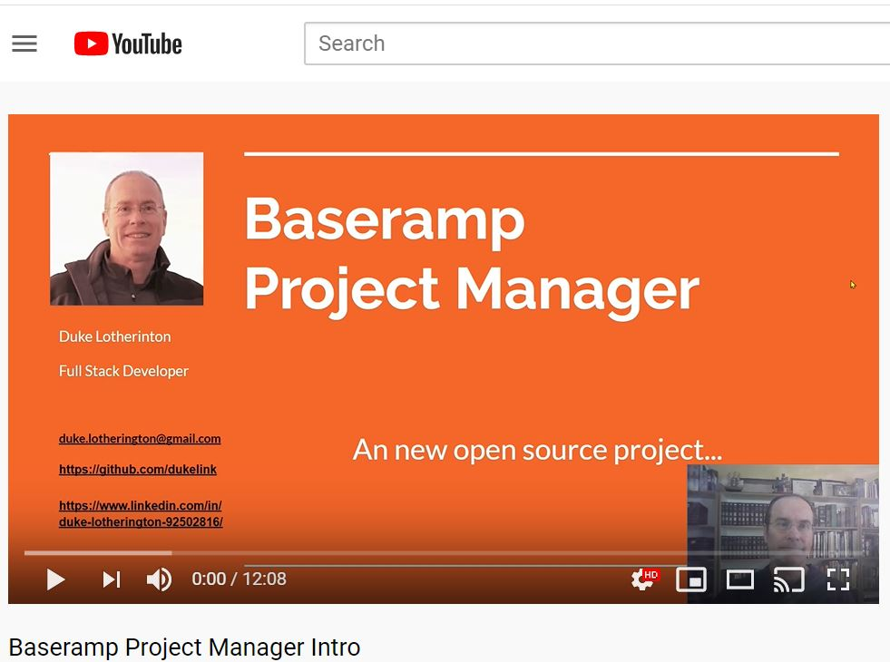
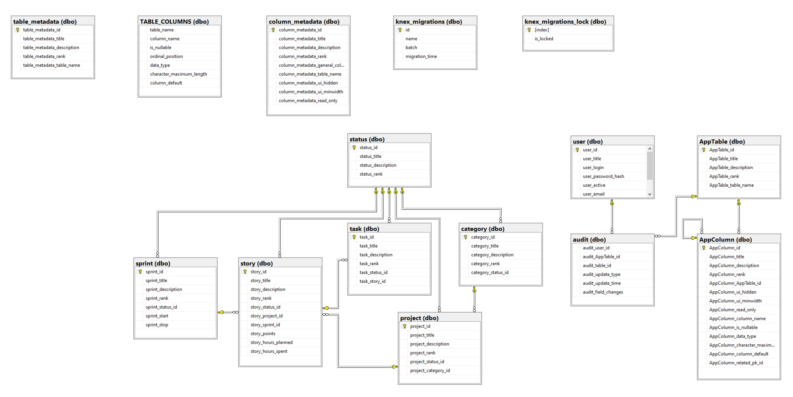

# Baseramp Tracker Intro

Baseramp Tracker - An open source Project Management software built as a Single Page Application (SPA) and Progressive Web Application (PWA) using Typescript, React, and an extensible SQL database model.

Version 1.0 and a contributor guide will be forthcoming. Here are some slide, and a video to describe and demo the project:

<!--a href=""-->

<!--/a-->

# Video Into to Project

[Baseramp Tracker Intro Video](https://youtu.be/8a5TfmJIXd8)

# Database ERD

