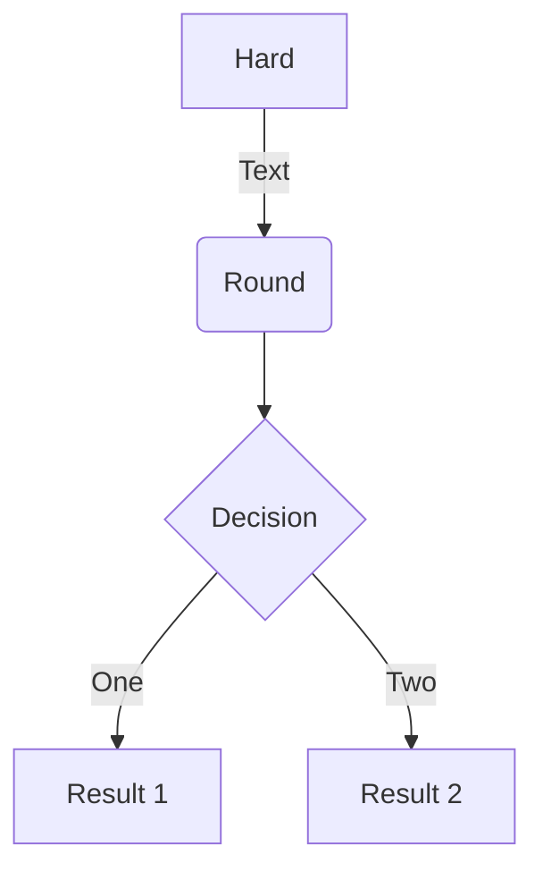
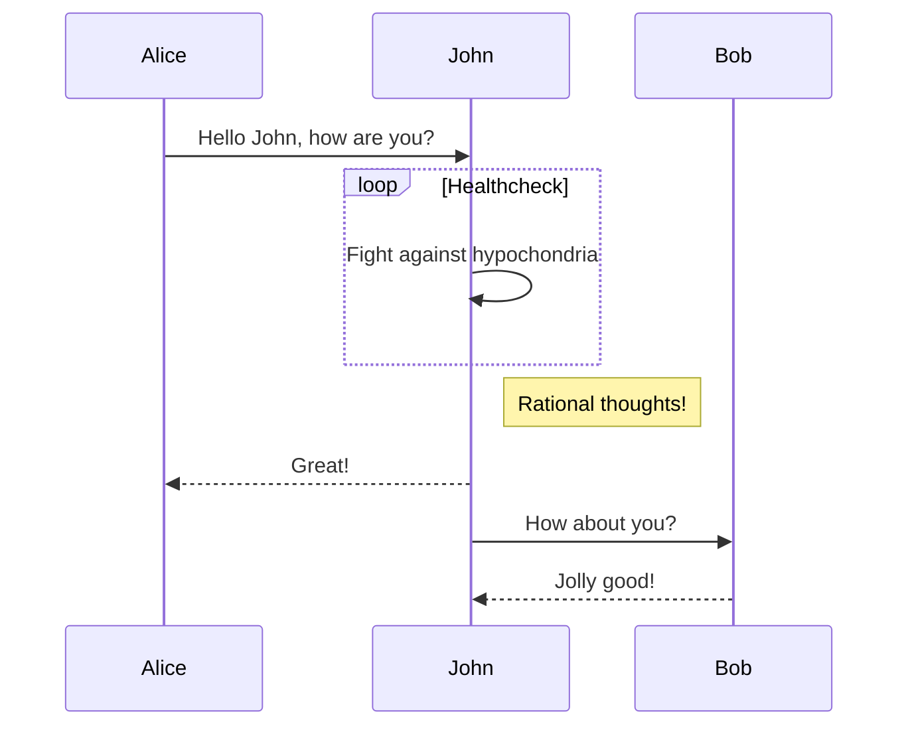
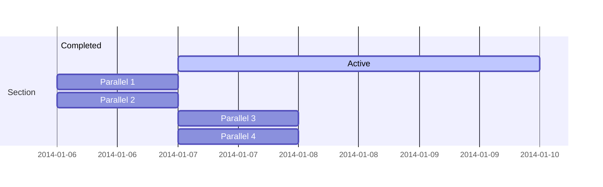
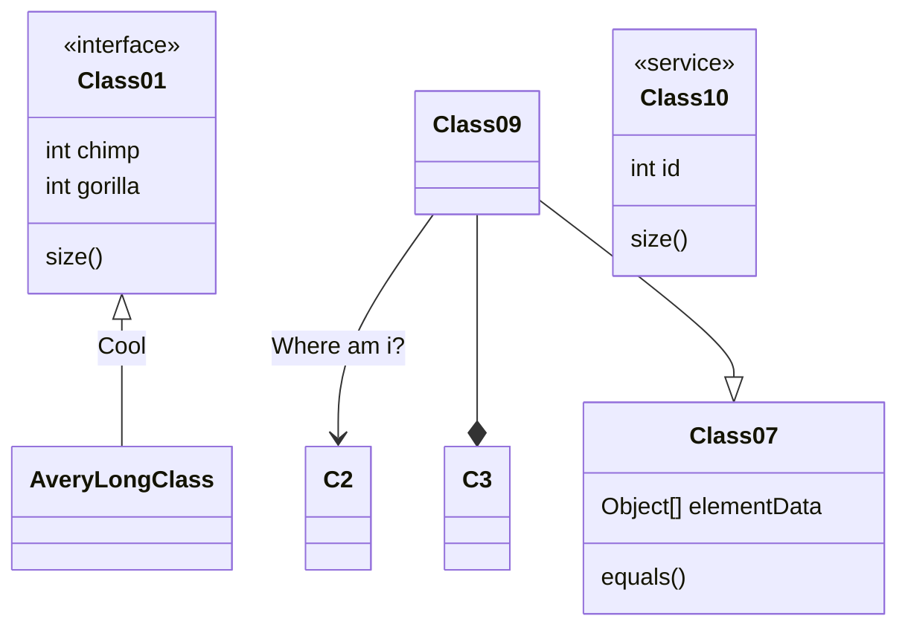
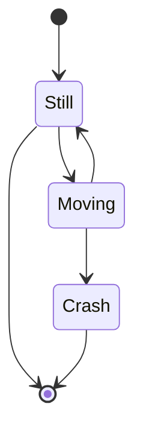
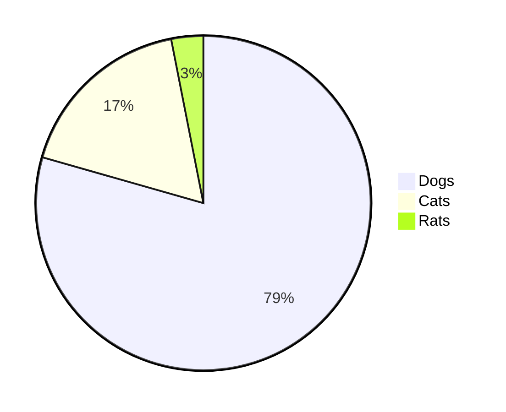

# File sizes after gzip:
```
Added Redux (although not used in logic yet):
  142.18 KB (+35.4 KB)  build\static\js\2.c4ed3a35.chunk.js
  6.6 KB (+649 B)       build\static\js\main.60c71a63.chunk.js
  779 B (-432 B)        build\static\js\runtime-main.f381864c.js
  457 B                 build\static\css\main.016cf4f4.chunk.css
  NOTE: Why they huge 35K increase???
```

```
Commented out Redux:
  137.07 KB (-5.1 KB)  build\static\js\2.839202c1.chunk.js
  6.44 KB (-162 B)     build\static\js\main.3f69ecac.chunk.js
  779 B                build\static\js\runtime-main.f381864c.js
  457 B                build\static\css\main.016cf4f4.chunk.css
```

``` 
Remomved manually designed forms:
  137.08 KB (+6 B)  build\static\js\2.c2e34391.chunk.js
  6.28 KB (-197 B)  build\static\js\main.10c5b8f1.chunk.js
  779 B             build\static\js\runtime-main.f381864c.js
  457 B             build\static\css\main.016cf4f4.chunk.css
```

``` 
UI refinements...
  137.08 KB  build\static\js\2.c2e34391.chunk.js
  6.43 KB    build\static\js\main.8ef5cd86.chunk.js
  779 B      build\static\js\runtime-main.f381864c.js
  457 B      build\static\css\main.016cf4f4.chunk.css
```

```
Update Libraries / refactors / and new xref feature...
  145.84 KB (+4 B)  build\static\js\2.e804f2f3.chunk.js
  6.42 KB (-314 B)  build\static\js\main.745df201.chunk.js
  780 B             build\static\js\runtime-main.4b146d07.js
  457 B             build\static\css\main.016cf4f4.chunk.css
```

```
Change format of downloaded tables from array to object (with database PK used for keys):
            Physical :  1762
              Source :  1417
             Comment :  180
 Single-line comment :  151
       Block comment :  29
               Mixed :  31
 Empty block comment :  0
               Empty :  196
               To Do :  8
Number of files read :  27
  145.84 KB        build\static\js\2.e804f2f3.chunk.js
  6.44 KB (+14 B)  build\static\js\main.aa248f59.chunk.js
  780 B            build\static\js\runtime-main.4b146d07.js
  457 B            build\static\css\main.016cf4f4.chunk.css
```

```
Added modern Redux ToolKit patterns to Sample page...
            Physical :  1761
              Source :  1407
             Comment :  180
 Single-line comment :  143
       Block comment :  37
               Mixed :  34
 Empty block comment :  0
               Empty :  208
               To Do :  10
Number of files read :  22
  157.88 KB (+66 B)  build\static\js\2.23550455.chunk.js
  6.71 KB (+107 B)   build\static\js\main.6c9dbc64.chunk.js
  780 B              build\static\js\runtime-main.4b146d07.js
  317 B              build\static\css\main.6ddade24.chunk.css
```

```
Initial implementation of Redux:
            Physical :  1543
              Source :  1279
             Comment :  126
 Single-line comment :  89
       Block comment :  37
               Mixed :  28
 Empty block comment :  0
               Empty :  166
               To Do :  5
Number of files read :  20
  157.98 KB (+107 B)  build\static\js\2.95c529cc.chunk.js
  6.12 KB (-604 B)    build\static\js\main.7e7aeb0d.chunk.js        
  780 B               build\static\js\runtime-main.4b146d07.js      
  317 B               build\static\css\main.6ddade24.chunk.css     
```

```
Perfected xref filtering with model.derivedModel
            Physical :  1599
              Source :  1327
             Comment :  132
 Single-line comment :  93
       Block comment :  39
               Mixed :  31
 Empty block comment :  0
               Empty :  171
               To Do :  8
Number of files read :  21
  158 KB           build\static\js\2.e7c21669.chunk.js
  6.29 KB (+62 B)  build\static\js\main.4829916c.chunk.js
  780 B            build\static\js\runtime-main.4b146d07.js
  317 B            build\static\css\main.6ddade24.chunk.css
```

```
Changed AutoForm to class component; removed unneeded useClass...
            Physical :  1637
              Source :  1372
             Comment :  134
 Single-line comment :  95
       Block comment :  39
               Mixed :  35
 Empty block comment :  0
               Empty :  166
               To Do :  9
Number of files read :  21  
  157.73 KB (-283 B)  build\static\js\2.fd84eb8d.chunk.js
  6.43 KB (+117 B)    build\static\js\main.82d36674.chunk.js
  780 B               build\static\js\runtime-main.4b146d07.js        
  317 B               build\static\css\main.6ddade24.chunk.css    
```

```
Refine XREF hack / correct edge cases...
            Physical :  1688
              Source :  1392
             Comment :  164
 Single-line comment :  125
       Block comment :  39
               Mixed :  38
 Empty block comment :  0
               Empty :  170
               To Do :  10
Number of files read :  21
  157.73 KB        build\static\js\2.cb1a2fa9.chunk.js
  6.52 KB (+95 B)  build\static\js\main.f55bd12d.chunk.js
  780 B            build\static\js\runtime-main.4b146d07.js
  317 B            build\static\css\main.6ddade24.chunk.css
```

```
Added initial Login page...
            Physical :  1985
              Source :  1627
             Comment :  184
 Single-line comment :  148
       Block comment :  36
               Mixed :  40
 Empty block comment :  0
               Empty :  214
               To Do :  14
Number of files read :  25
  158.01 KB  build\static\js\2.32592e31.chunk.js
  10.42 KB   build\static\js\main.5bb8ca3d.chunk.js
  779 B      build\static\js\runtime-main.af831f84.js
  317 B      build\static\css\main.6ddade24.chunk.css
```

```
Added mobile friendly flyout panel for system navigation control...
            Physical :  2423
              Source :  1770
             Comment :  453
 Single-line comment :  151
       Block comment :  302
               Mixed :  43
 Empty block comment :  50
               Empty :  293
               To Do :  17
Number of files read :  26
  159.21 KB (+983 B)  build\static\js\2.f849bb9d.chunk.js
  11.07 KB (+631 B)   build\static\js\main.a531165a.chunk.js
  783 B               build\static\js\runtime-main.bae97f51.js
  581 B               build\static\css\2.8271af8e.chunk.css
  327 B (+10 B)       build\static\css\main.2af95729.chunk.css
```

```
Complete offline demo mode...
            Physical :  2465
              Source :  1762
             Comment :  487
 Single-line comment :  162
       Block comment :  325
               Mixed :  42
 Empty block comment :  56
               Empty :  314
               To Do :  18
Number of files read :  28
  159.48 KB (+44 B)  build\static\js\2.11ad91cd.chunk.js
  11.1 KB (+187 B)   build\static\js\main.5171f437.chunk.js
  783 B              build\static\js\runtime-main.bae97f51.js
  581 B              build\static\css\2.8271af8e.chunk.css
  327 B              build\static\css\main.2af95729.chunk.css
```

```
Update to 'local' authentication & offload login management to server-side node forms...
  157.74 KB  build\static\js\2.df8d266e.chunk.js
  10.86 KB   build\static\js\main.5f22871a.chunk.js
  783 B      build\static\js\runtime-main.bae97f51.js
  581 B      build\static\css\2.8271af8e.chunk.css
  327 B      build\static\css\main.2af95729.chunk.css
```

```
Sort out authentication:
  159.48 KB  build\static\js\2.e9e26672.chunk.js
  11.29 KB   build\static\js\main.4565893c.chunk.js
  783 B      build\static\js\runtime-main.bae97f51.js
  581 B      build\static\css\2.8271af8e.chunk.css
  327 B      build\static\css\main.2af95729.chunk.css
```

```
Refine Account Log In / Log Out...
  157.26 KB (-1.87 KB)  build\static\js\2.77c9f399.chunk.js
  11.39 KB (+44 B)      build\static\js\main.123cf8ac.chunk.js
  783 B                 build\static\js\runtime-main.bae97f51.js
  583 B                 build\static\css\2.47271137.chunk.css
  336 B                 build\static\css\main.2af95729.chunk.css
              Physical :  2625
              Source :  1892
             Comment :  524
 Single-line comment :  167
       Block comment :  357
               Mixed :  52
 Empty block comment :  60
               Empty :  321
               To Do :  20
Number of files read :  29
```

```
Replace some drill props with custom hooks; progress on new user registration:
            Physical :  2732
              Source :  1976
             Comment :  549
 Single-line comment :  172
       Block comment :  377
               Mixed :  55
 Empty block comment :  64
               Empty :  326
               To Do :  22
Number of files read :  30
  157.23 KB (-38 B)  build\static\js\2.4bef3d5b.chunk.js
  11.61 KB (+227 B)  build\static\js\main.4eeca061.chunk.js
  783 B              build\static\js\runtime-main.bae97f51.js
  583 B              build\static\css\2.47271137.chunk.css
  336 B              build\static\css\main.2af95729.chunk.css
```

```
Refactoring NodeForm & NodeFormView...
            Physical :  2737
              Source :  1982
             Comment :  551
 Single-line comment :  174
       Block comment :  377
               Mixed :  56
 Empty block comment :  64
               Empty :  324
               To Do :  24
Number of files read :  30
  157.23 KB (+2 B)   build\static\js\2.47933f37.chunk.js
  11.37 KB (-251 B)  build\static\js\main.21e31d9d.chunk.js       
  783 B              build\static\js\runtime-main.bae97f51.js     
  583 B              build\static\css\2.47271137.chunk.css        
  336 B              build\static\css\main.2af95729.chunk.css    
```

```
Implement an interface between NodeForms and form CRUD operations...
            Physical :  2901
              Source :  2095
             Comment :  599
 Single-line comment :  191
       Block comment :  408
               Mixed :  64
 Empty block comment :  68
               Empty :  339
               To Do :  23
Number of files read :  31
  157.29 KB (+60 B)  build\static\js\2.b36772eb.chunk.js
  11.82 KB (+250 B)  build\static\js\main.72c0680b.chunk.js
  783 B              build\static\js\runtime-main.bae97f51.js
  583 B              build\static\css\2.47271137.chunk.css
  336 B              build\static\css\main.2af95729.chunk.css
```

```
Added logic to intelligently initialize newly added record...
            Physical :  2928
              Source :  2113
             Comment :  604
 Single-line comment :  200
       Block comment :  404
               Mixed :  62
 Empty block comment :  68
               Empty :  341
               To Do :  23
Number of files read :  31
  157.29 KB (+1 B)   build\static\js\2.835d2b02.chunk.js
  11.96 KB (+106 B)  build\static\js\main.6aa8babd.chunk.js
  783 B              build\static\js\runtime-main.bae97f51.js
  583 B              build\static\css\2.47271137.chunk.css
  336 B              build\static\css\main.2af95729.chunk.css
```

```
Refresh NPM dependencies to latest version...
            Physical :  3018
              Source :  2155
             Comment :  634
 Single-line comment :  210
       Block comment :  424
               Mixed :  60
 Empty block comment :  72
               Empty :  361
               To Do :  23
Number of files read :  32
  154.8 KB (-2.53 KB)  build\static\js\2.565abd1f.chunk.js
  12.03 KB (-17 B)     build\static\js\main.749e61b9.chunk.js
  783 B                build\static\js\runtime-main.bae97f51.js        
  583 B                build\static\css\2.47271137.chunk.css
  336 B                build\static\css\main.2af95729.chunk.css   
```

```
Improve resonsive navigation using JavaScript:
            Physical :  3063
              Source :  2198
             Comment :  620
 Single-line comment :  201
       Block comment :  419
               Mixed :  54
 Empty block comment :  72
               Empty :  371
               To Do :  22
Number of files read :  32
  155.61 KB  build\static\js\2.b3d1e235.chunk.js        
  12.32 KB   build\static\js\main.484291d6.chunk.js     
  783 B      build\static\js\runtime-main.fd5b1e98.js   
  583 B      build\static\css\2.47271137.chunk.css      
  336 B      build\static\css\main.2af95729.chunk.css   
```

```
File sizes after gzip:
  153.91 KB  build\static\js\2.caec9d44.chunk.js
  11.83 KB   build\static\js\main.14483712.chunk.js
  783 B      build\static\js\runtime-main.fd5b1e98.js
  583 B      build\static\css\2.47271137.chunk.css
  434 B      build\static\css\main.2c61f976.chunk.css
            Physical :  3072
              Source :  2186
             Comment :  629
 Single-line comment :  181
       Block comment :  448
               Mixed :  46
 Empty block comment :  76
               Empty :  379
               To Do :  18
Number of files read :  33  
```

```
Release refactored Sprint-Projects XREF feature:
  153.91 KB  build\static\js\2.c08fc1a2.chunk.js
  12.28 KB   build\static\js\main.ecd67824.chunk.js
  783 B      build\static\js\runtime-main.fd5b1e98.js
  583 B      build\static\css\2.47271137.chunk.css
  434 B      build\static\css\main.2c61f976.chunk.css
            Physical :  3220
              Source :  2274
             Comment :  694
 Single-line comment :  213
       Block comment :  481
               Mixed :  52
 Empty block comment :  84
               Empty :  388
               To Do :  19
Number of files read :  35  
```

```
05/14/2020 - Performance refactors:

Client: (npx sloc src -e "test")
  156.49 KB  build\static\js\2.3fe3150f.chunk.js
  11.85 KB   build\static\js\main.d090daac.chunk.js
  783 B      build\static\js\runtime-main.fd5b1e98.js
  583 B      build\static\css\2.47271137.chunk.css
  434 B      build\static\css\main.2c61f976.chunk.css
            Physical :  4367
              Source :  2997
             Comment :  1043
 Single-line comment :  383
       Block comment :  660
               Mixed :  75
 Empty block comment :  112
               Empty :  514
               To Do :  26
Number of files read :  42

Server: (npx sloc routes app.ts)
            Physical :  1130
              Source :  703
             Comment :  330
 Single-line comment :  173
       Block comment :  157
               Mixed :  17
 Empty block comment :  27
               Empty :  141
               To Do :  21
Number of files read :  7
```

# HELPFUL SNIPPETS:

npx sloc src -- get lines of code reports, presented above
choco upgrade yarn 

# DOC TEST:


## See https://libraries.io/npm/mermaid ...











